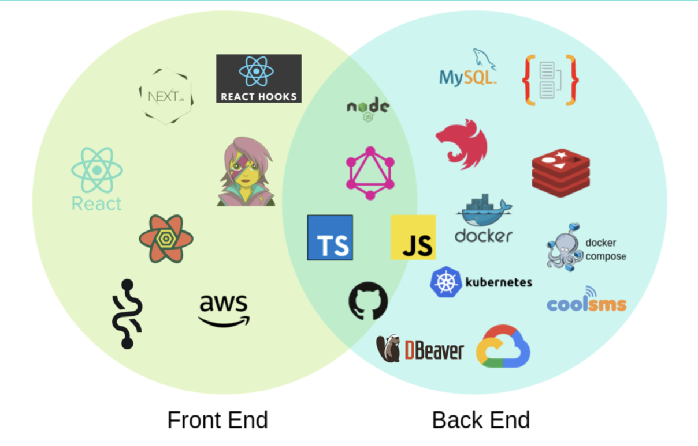
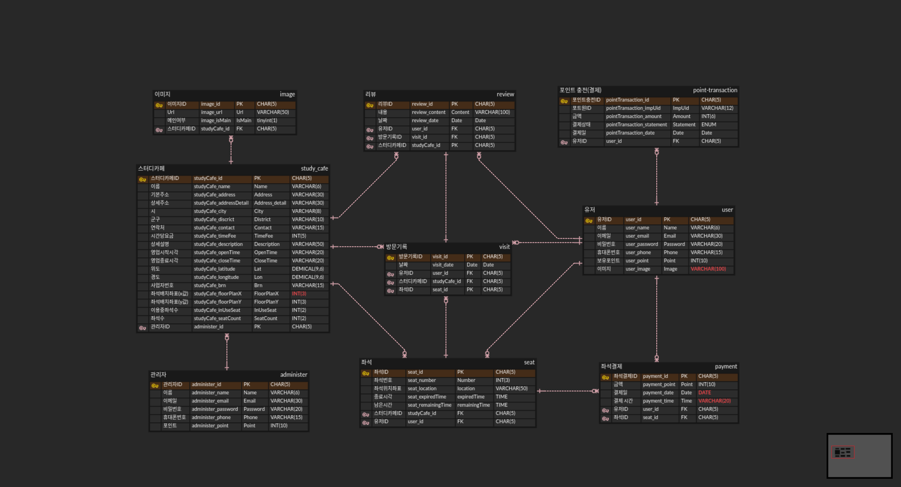
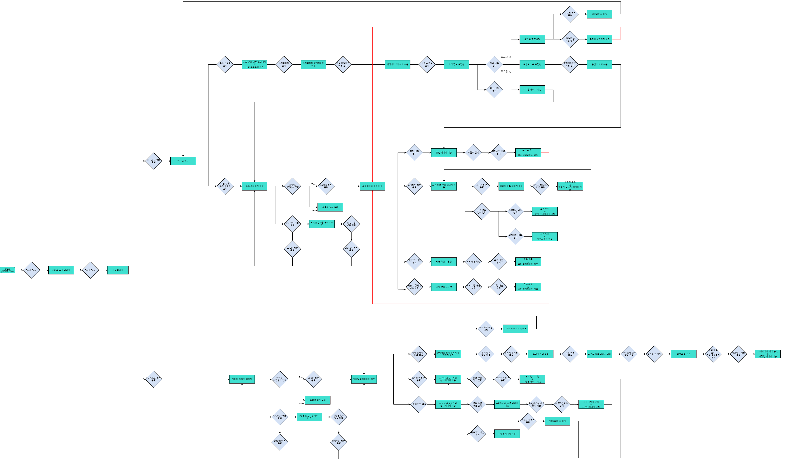
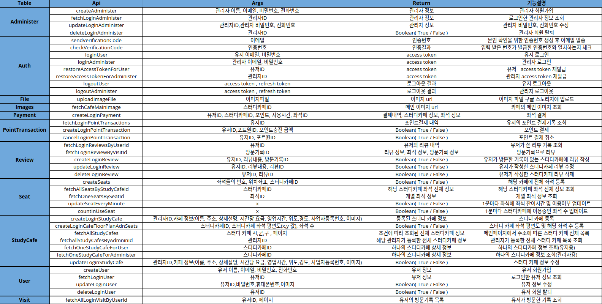
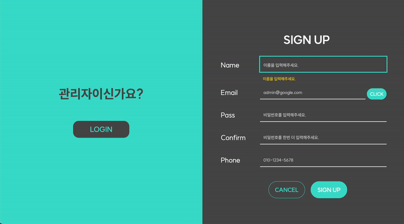
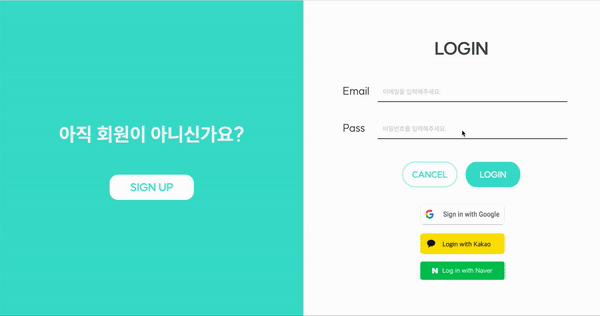
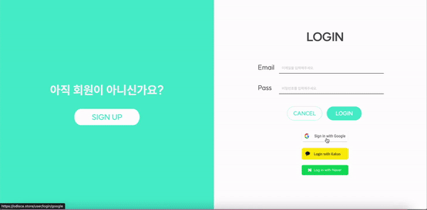
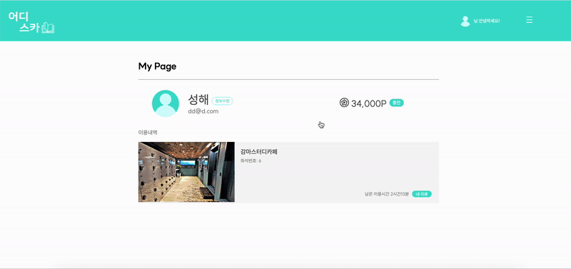
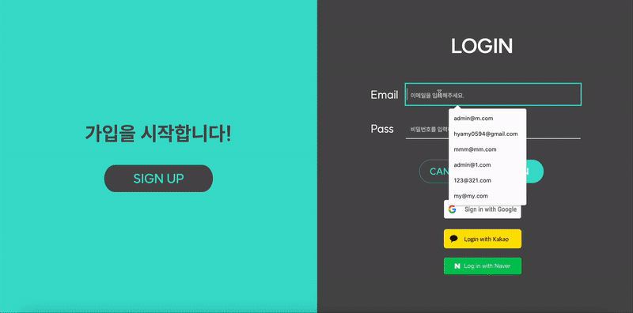

# 📖 어디스카(Where is StudyCafe?)
## ✔ 팀원 소개
<table align="center">
    <tr align="center">
        <td style="min-width: 240px;">
            <a href="https://github.com/eunpyeong114">
              
              <br />
              <b>전은평</b>
            </a> 
        </td>
        <td style="min-width: 220px;">
            <a href="https://github.com/Middledown">
              
              <br />
              <b>마정하 </b>
            </a>
        </td>
      </tr>
        <td>
        - 초기 배포 및 배포 관리
		    <br>
        - google-storage관리
        <br>
        - user API 
        <br>
        - administer API
        <br>
        - studyCafeAPI
        <br>
      	- seat API   
        <br>
       	- Image API 
        <br>
        - 좌석별 잔여시간 1분마다 업데이트 API
        <br>
        - git 관리
        </td>
        <td>
        - 배포 관리
        <br>
        - Review API
        <br>
        - Payment API
        <br>
        - PointTransaction API
        <br>
        - Visit API
        <br>
        - iamport결제 검증 API
        <br>
        - 스터디카페별 이용중인 좌석 1분마다 업데이트 API
        <br>
        - git 관리
        </td>
</table>

 ## ✔ 프로젝트 목표
‘카공족’이라는 신조어가 생길 정도로 카페에서 하루종일 공부하는 것이 사회적으로 문제가 되고 있고, 이에 맞춰 스터디 카페가 대거 등장하고 있습니다.

하지만 스터디 카페가 많이 생겨난 만큼, 스터디 카페에 대한 정보를 얻기란 여간 번거로운 일이 아닙니다. 비록 찾아서 가더라도 만석이라, 헛걸음을 하는 경우도 많습니다.

'어디스카'를 이용하게 되면 내 주변 스터디 카페 검색 뿐만 아니라 실시간으로 사용가능 좌석 및 남은 시간을 확인할 수 있으며, 동시에 해당 좌석 사용 결제도 가능합니다.

1분 1초가 아까운 시험기간, 여러 스터디 카페를 배회하며 시간을 버리는 것이 아니라, '오로지 공부에만 집중'할 수 있게 도와줄 수 있습니다.


 ## ✔ 기술 스택

 
 ## ✔ ERD(Entity-Relationship Diagram)


## ✔ UserFlow


## ✔ API Document


## 
 ## ✔ 폴더구조
```
📦src
 ┣ 📂apis
 ┃ ┣ 📂administers
 ┃ ┃ ┣ 📂dto
 ┃ ┃ ┃ ┣ 📜create-administer.input.ts
 ┃ ┃ ┃ ┗ 📜update-login-administer.input.ts
 ┃ ┃ ┣ 📂entities
 ┃ ┃ ┃ ┗ 📜administer.entity.ts
 ┃ ┃ ┣ 📂interfaces
 ┃ ┃ ┃ ┗ 📜administers-service.interface.ts
 ┃ ┃ ┣ 📜administers.module.ts
 ┃ ┃ ┣ 📜administers.resolver.ts
 ┃ ┃ ┗ 📜administers.service.ts
 ┃ ┣ 📂auth
 ┃ ┃ ┣ 📂dto
 ┃ ┃ ┃ ┣ 📜login-administer.input.ts
 ┃ ┃ ┃ ┗ 📜login-user.input.ts
 ┃ ┃ ┣ 📂guards
 ┃ ┃ ┃ ┣ 📜dynamic-auth.guard.ts
 ┃ ┃ ┃ ┗ 📜gql-auth.guard.ts
 ┃ ┃ ┣ 📂interfaces
 ┃ ┃ ┃ ┗ 📜auth-service.interface.ts
 ┃ ┃ ┣ 📂strategies
 ┃ ┃ ┃ ┣ 📜jwt-administer-access.strategy.ts
 ┃ ┃ ┃ ┣ 📜jwt-administer-refresh.strategy.ts
 ┃ ┃ ┃ ┣ 📜jwt-social-google.strategy.ts
 ┃ ┃ ┃ ┣ 📜jwt-social-kakao.strategy.ts
 ┃ ┃ ┃ ┣ 📜jwt-social-naver.strategy.ts
 ┃ ┃ ┃ ┣ 📜jwt-user-access.strategy.ts
 ┃ ┃ ┃ ┗ 📜jwt-user-refresh.strategy.ts
 ┃ ┃ ┣ 📜auth.controller.ts
 ┃ ┃ ┣ 📜auth.module.ts
 ┃ ┃ ┣ 📜auth.resolever.ts
 ┃ ┃ ┗ 📜auth.service.ts
 ┃ ┣ 📂files
 ┃ ┃ ┣ 📂interfaces
 ┃ ┃ ┃ ┗ 📜files-service.interface.ts
 ┃ ┃ ┣ 📜files.module.ts
 ┃ ┃ ┣ 📜files.resolver.ts
 ┃ ┃ ┗ 📜files.service.ts
 ┃ ┣ 📂iamport
 ┃ ┃ ┣ 📂interfaces
 ┃ ┃ ┃ ┗ 📜iamport-service.interface.ts
 ┃ ┃ ┗ 📜iamport.service.ts
 ┃ ┣ 📂images
 ┃ ┃ ┣ 📂dto
 ┃ ┃ ┃ ┗ 📜create-image.input.ts
 ┃ ┃ ┣ 📂entities
 ┃ ┃ ┃ ┗ 📜image.entity.ts
 ┃ ┃ ┣ 📂interfaces
 ┃ ┃ ┃ ┗ 📜images-service.interface.ts
 ┃ ┃ ┣ 📜images.module.ts
 ┃ ┃ ┣ 📜images.resolver.ts
 ┃ ┃ ┗ 📜images.service.ts
 ┃ ┣ 📂payments
 ┃ ┃ ┣ 📂dto
 ┃ ┃ ┃ ┣ 📜create-payment.input.ts
 ┃ ┃ ┃ ┣ 📜create-payment.object.ts
 ┃ ┃ ┃ ┗ 📜create-payment.return.ts
 ┃ ┃ ┣ 📂entities
 ┃ ┃ ┃ ┗ 📜payment.entity.ts
 ┃ ┃ ┣ 📂interfaces
 ┃ ┃ ┃ ┗ 📜payment-service.interface.ts
 ┃ ┃ ┣ 📜payment.module.ts
 ┃ ┃ ┣ 📜payment.resolver.ts
 ┃ ┃ ┗ 📜payment.service.ts
 ┃ ┣ 📂pointTransactions
 ┃ ┃ ┣ 📂dto
 ┃ ┃ ┃ ┗ 📜create-pointTransactions.input.ts
 ┃ ┃ ┣ 📂entities
 ┃ ┃ ┃ ┗ 📜pointTransaction.entity.ts
 ┃ ┃ ┣ 📂interfaces
 ┃ ┃ ┃ ┗ 📜pointTransactions-service.interface.ts
 ┃ ┃ ┣ 📜pointTransactions.module.ts
 ┃ ┃ ┣ 📜pointTransactions.resolver.ts
 ┃ ┃ ┗ 📜pointTransactions.service.ts
 ┃ ┣ 📂reviews
 ┃ ┃ ┣ 📂dto
 ┃ ┃ ┃ ┗ 📜create-reviews.input.ts
 ┃ ┃ ┣ 📂entities
 ┃ ┃ ┃ ┗ 📜review.entity.ts
 ┃ ┃ ┣ 📂interfaces
 ┃ ┃ ┃ ┗ 📜reviews-service.interface.ts
 ┃ ┃ ┣ 📜reviews.module.ts
 ┃ ┃ ┣ 📜reviews.resolver.ts
 ┃ ┃ ┗ 📜reviews.service.ts
 ┃ ┣ 📂seats
 ┃ ┃ ┣ 📂dto
 ┃ ┃ ┃ ┣ 📜create-seats-information.input.ts
 ┃ ┃ ┃ ┗ 📜create-seats.input.ts
 ┃ ┃ ┣ 📂entities
 ┃ ┃ ┃ ┗ 📜seat.entity.ts
 ┃ ┃ ┣ 📂interfaces
 ┃ ┃ ┃ ┗ 📜seats-service.interface.ts
 ┃ ┃ ┣ 📜seats.module.ts
 ┃ ┃ ┣ 📜seats.resolver.ts
 ┃ ┃ ┗ 📜seats.service.ts
 ┃ ┣ 📂studyCafes
 ┃ ┃ ┣ 📂dto
 ┃ ┃ ┃ ┣ 📜create-floorPlan.input.ts
 ┃ ┃ ┃ ┣ 📜create-studyCafe.input.ts
 ┃ ┃ ┃ ┣ 📜fetch-all-studyCafes.input.ts
 ┃ ┃ ┃ ┗ 📜update-studyCafe.input.ts
 ┃ ┃ ┣ 📂entities
 ┃ ┃ ┃ ┗ 📜studyCafe.entity.ts
 ┃ ┃ ┣ 📂interfaces
 ┃ ┃ ┃ ┗ 📜studyCafes-service.interfaces.ts
 ┃ ┃ ┣ 📜studyCafes.module.ts
 ┃ ┃ ┣ 📜studyCafes.resolver.ts
 ┃ ┃ ┗ 📜studyCafes.service.ts
 ┃ ┣ 📂users
 ┃ ┃ ┣ 📂dto
 ┃ ┃ ┃ ┣ 📜create-user.input.ts
 ┃ ┃ ┃ ┗ 📜update-login-user.input.ts
 ┃ ┃ ┣ 📂entities
 ┃ ┃ ┃ ┗ 📜user.entity.ts
 ┃ ┃ ┣ 📂interfaces
 ┃ ┃ ┃ ┗ 📜users-service.interface.ts
 ┃ ┃ ┣ 📜users.module.ts
 ┃ ┃ ┣ 📜users.resolver.ts
 ┃ ┃ ┗ 📜users.service.ts
 ┃ ┗ 📂visit
 ┃ ┃ ┣ 📂entities
 ┃ ┃ ┃ ┗ 📜visit.entity.ts
 ┃ ┃ ┣ 📜visit.module.ts
 ┃ ┃ ┣ 📜visit.resolver.ts
 ┃ ┃ ┗ 📜visit.service.ts
 ┣ 📂common
 ┃ ┗ 📂interfaces
 ┃ ┃ ┗ 📜context.ts
 ┣ 📜app.module.ts
 ┗ 📜main.ts
 ```
 
 ### ✔ URL
 Service : https://odisca.co.kr/<hr>
 Client: https://github.com/code-bootcamp/odisca_client<hr>
 Server : https://github.com/code-bootcamp/odisca_server
 ## ✔ 구현 화면
## 📚 랜딩 페이지


## 📚 회원가입 페이지


## 📚 로그인


## 📚 소셜로그인


## 📚 메인페이지


## 📚 스터디카페 상세페이지


## 📚 좌석 조회 및 결제페이지


## 📚 유저 마이페이지


## 📚 관리자 페이지


## 📚 리뷰 페이지


### <a href="https://www.youtube.com/watch?v=A8hUqDYSWu0">📺 시현 영상 보러가기</a>
